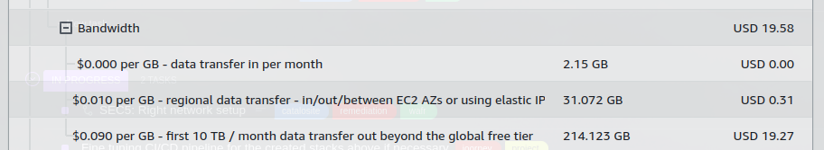

# Data transfer analyzis

According to your billing information in August 2023 the estimated cost related to data transfer is USD 19.80

The most of the cost is coming from the Frankfurt region, and is originated from 'Bandwith' costs.

Catalosite does web serving and serve content for it's customers.

It can be seen that data transfer cost numbers are quite small.

## Conclusion

Creating any kind of infrastructure costs money in AWS and it does not worth the effort to save a couple of dollars on data transfer since you would pay more on the new infrastructure created.