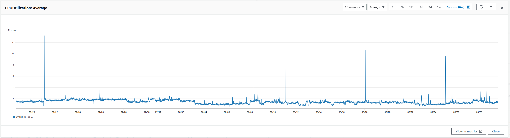
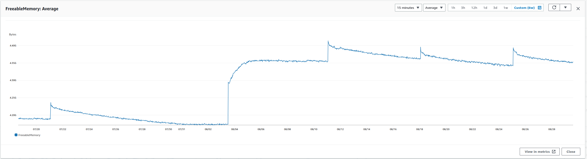
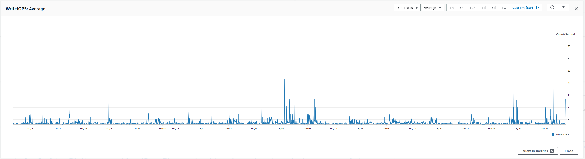
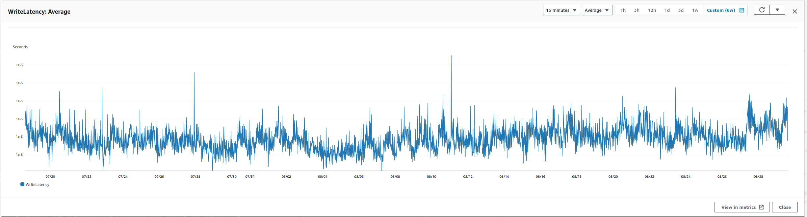
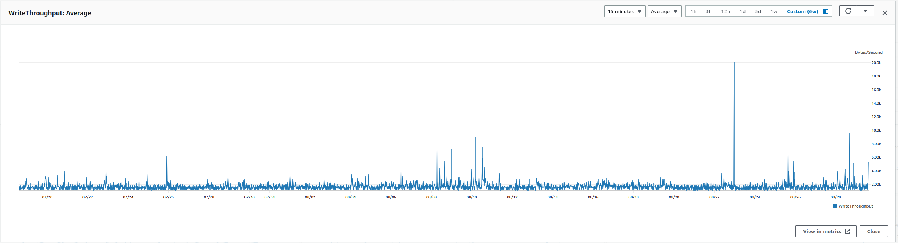
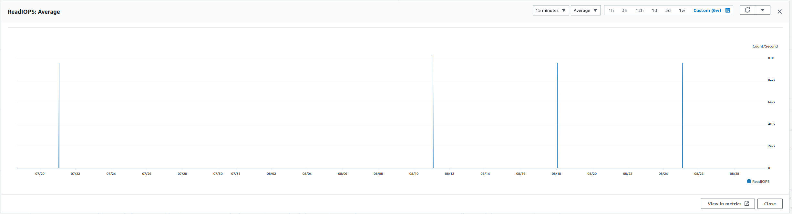
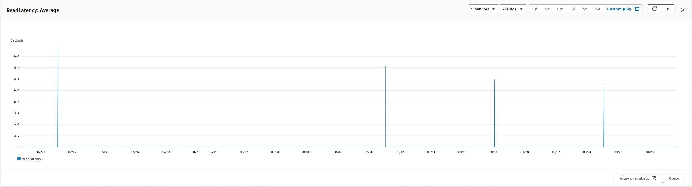
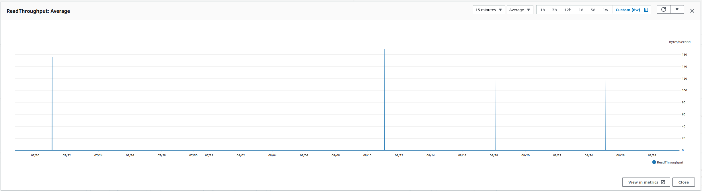

# DB Performance analyzis and cost optimization recommendations

## Foundation

Catalosite uses one Aurora Mysql cluster (engine version 5.7.mysql_aurora.2.07.2) with one db writer instance  in eu-central-1b region. Instance type: db.r5.large (2 vCPU, 16 GB memory).

## Performance

Based on metrics back to 6 weeks (see screenshots in Addendum) the database works flawless.

The CPU utilization is low ~ 7 percent with couple of spikes that did not go up to 13 percent.
The Memory utilization is optimal with around 4.3 GB freeable memory that means ~ 73% memory utilization.
Comparing the CPU and Memory usage rate the choosen R5 (memory-optimized) **instance type was a well-founded decision**.

The troughput, latency and other metrics does not show high numbers, generally they are all low.

The instance size is also **optimal**.

## Recommendations

It is recommended to change db engine. The version used is deprecated by AWS since 30 June 2023. I would recommend to change to Aurora MySQL 3.03.2 (compatible with MySQL 8.0.26) which is just below the latest version.

## Other findings/recommendation

- Utilize encrypted database (encyption in rest)
- Set up Multi AZ for fault tolerance and high availability
- Enable automatic minor version upgrades - to benefit from the latest security and functionality fixes

## Cost optimization

The only thing I would suppose to consider change to Reserved instance.

[Read more about reserved db instances](https://docs.aws.amazon.com/AmazonRDS/latest/AuroraUserGuide/USER_WorkingWithReservedDBInstances.html)

### Approximate saving:

| Current cost (On Demand) | Reserved Instance cost |
| -------------------------|----------------------- |
| $0.29/hour | $0.1918/hour |

Saving is only applies for the compute resource, not for storage, etc. [read more](https://docs.aws.amazon.com/AmazonRDS/latest/AuroraUserGuide/USER_WorkingWithReservedDBInstances.html#:~:text=Example%20using%20Aurora%20Standard)

Counting with a 30 day month:

`$0.0982` (saving hourly) * 24 hour * 30 days = `$70.704/month`

### How to purchase reserved RDS instance

This is something you should do for yourself.

Follow the [video guide](https://www.youtube.com/watch?v=v0fABeAhjME) here

## Addendum

1. CPU Utilization

2. Memory Utilization

3. Write IOPS

4. Write Latency

5. Write Throughput

6. Read IOPS

7. Read Latency

8. Read Throughput

